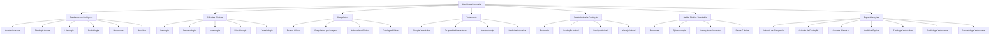

O Roadmap dos meus estudos são baseados no [link](https://roadmap.sh/r/embed?id=69b741c033a0ad7a576d41a7)

Abaixo uma representação deles:

```mermaid
flowchart TD

A[Medicina Veterinária] --> B[Fundamentos Biológicos]
A --> C[Ciências Clínicas]
A --> D[Diagnóstico]
A --> E[Tratamento]
A --> F[Saúde Animal e Produção]
A --> G[Saúde Pública Veterinária]
A --> H[Especializações]

%% Fundamentos
B --> B1[Anatomia Animal]
B --> B2[Fisiologia Animal]
B --> B3[Histologia]
B --> B4[Embriologia]
B --> B5[Bioquímica]
B --> B6[Genética]

%% Clínicas
C --> C1[Patologia]
C --> C2[Farmacologia]
C --> C3[Imunologia]
C --> C4[Microbiologia]
C --> C5[Parasitologia]

%% Diagnóstico
D --> D1[Exame Clínico]
D --> D2[Diagnóstico por Imagem]
D --> D3[Laboratório Clínico]
D --> D4[Patologia Clínica]

%% Tratamento
E --> E1[Cirurgia Veterinária]
E --> E2[Terapia Medicamentosa]
E --> E3[Anestesiologia]
E --> E4[Medicina Intensiva]

%% Produção
F --> F1[Zootecnia]
F --> F2[Produção Animal]
F --> F3[Nutrição Animal]
F --> F4[Manejo Animal]

%% Saúde pública
G --> G1[Zoonoses]
G --> G2[Epidemiologia]
G --> G3[Inspeção de Alimentos]
G --> G4[Saúde Pública]

%% Especializações
H --> H1[Animais de Companhia]
H --> H2[Animais de Produção]
H --> H3[Animais Silvestres]
H --> H4[Medicina Equina]
H --> H5[Patologia Veterinária]
H --> H6[Cardiologia Veterinária]
H --> H7[Dermatologia Veterinária]
```
